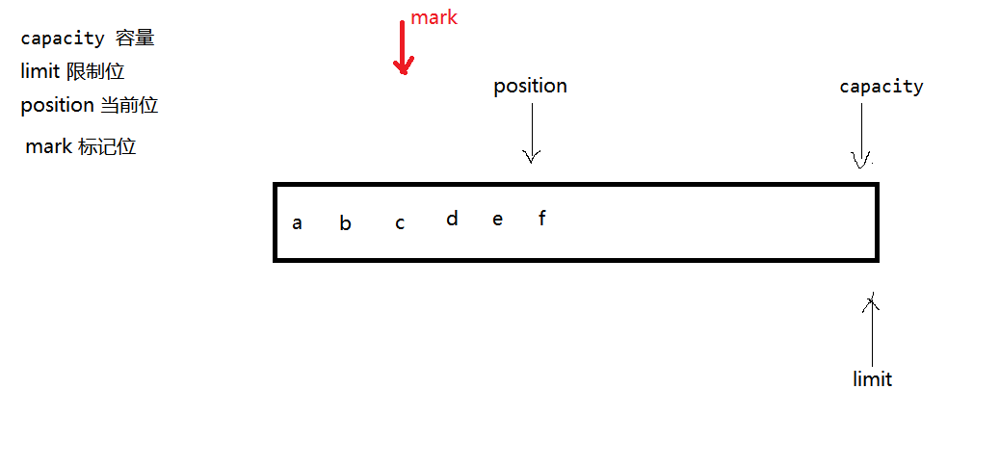
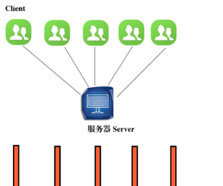
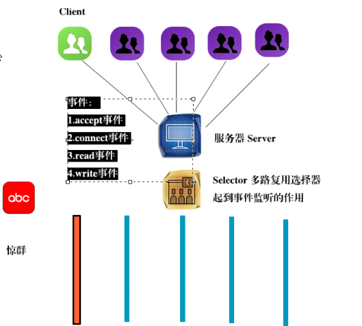
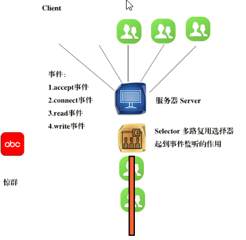
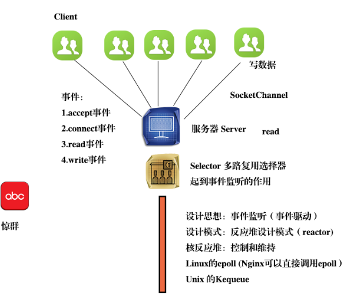

## 一、NIO -- new IO  -- NonBlocking IO

#### 1.概述
	JDK1.4 中提出的一套新的IO机制，区别与传统的BIO（Blocking IO）

	BIO在高并发场景下遇到了一些无法解决的问题 ---- ACCEPT CONNECT READ WRITE
	针对于每一个客户端都需要在服务器端创建对应线程来处理，线程开辟运行是非常耗费资源的，并且服务器所能支持的最大并发线程数量是有限的，
	所以当高并发到来时，服务器会存在性能瓶颈。
	所以我们想到用少量的线程同时处理多个客户端的连接。而由于传统的BIO阻塞式操作的特点，这种工作方式是无法实现的。

##### BIO:面向流操作字节字符,具有方向性
		InputStream OutputStream Reader Writer
##### NIO:面向通道操作缓冲区，可以双向传输数据
		Channel	Buffer Selector

#### 2.Buffer
	缓冲区，所谓的缓冲区其实就是在内存中开辟的一段连续空间，用来临时存放数据。
	

	int capacity();
	int position();
	position(int newPosition);
	int limit()
	limit(int newLimit)
		
	//1.创建Buffer
	static ByteBuffer allocate(int capacity)  
	static ByteBuffer wrap(byte[] array) 
	static ByteBuffer wrap(byte[] array, int offset, int length)  

	//2.写数据
	put(byte b) 
	put(byte[] src) 
	putXxx()
	.....

	//3.反转缓冲区
	buf.flip();//此方法等同于buf.limit(buf.position());buf.position(0);

	//4.读取数据
	byte get() 
	get(byte[] dst) 
	......

	//5.判断边界
	int remaning(); //相当于limit - position
	boolean hasRemaning();

	//6.重绕缓冲区
	rewind();

	//7.清空缓冲区
	clear();//将limit设置为capacity大小，postion设置为0，并不真的删除缓冲区中的旧有数据，基于buffer的原理，并不会有问题。

	//8.设置标记，重置标记
	mark();//设置标记
	reset();//重置到标记
	
	
### 3.Channel

	NIO是基于Channel工作操作的是Buffer
	Channel叫做通道，与Stream不同，可以双向的进行数据通信

	ServerSocketChannel
		ServerSocketChannel ssc = ServerSocketChannel.open();
		configureBlocking(false);//设置为非阻塞模式
	SocketChannel 
		SocketChannel sc = SocketChannel.open();
		configureBlocking(false);//设置为非阻塞模式

		**在非阻塞模式下，进行ACCEPT CONNECT READ WRITE 操作时都不会产生阻塞，它们只是尝试完成操作，并不保证操作一定执行完。所以通常我们需要自己控制循环来保证操作执行完成。

		SelectionKey register(Selector sel, int ops)//将当前通道注册到选择器中。sel：要被注册到的选择器。ops注册时指定的要关注的操作，操作可以有四种类型 - SelectionKey.OP_ACCEPT SelectionKey.OP_CONNECT SelectionKey.OP_READ SelectionKey.OP_WRITE

	DatagramChannel

	FileChannel	

### 4.Selector

	//获取选择器
	Selector.open();

	//将通道注册到选择器中让选择器管理这个通道
	channle.regeister(selc,ops)

	//检查已经注册在选择器上的通道关心的操作是否有已经就绪可以处理的
	int select() //检查注册在选择器上的通道们关心的事件是否已经有就绪可以处理的，如果有此方法返回，返回值为可以处理的数量，如果没有可处理的则此方法阻塞。

	//获取已经就绪的键的集合
	Set<SelectionKey> selectedKeys()
	
### 4.Selector设计思想

1. 问题的引入

	使用BIO编写代码模拟一下
	(编写一个服务器端和客户端程序，运行一次服务器程序，运行四次客户端程序模拟四个用户线程):

	public class BIOServer {
		public static void main(String[] args) throws Exception {
			ServerSocket ss = new ServerSocket();
			ss.bind(new InetSocketAddress(7777));
			while(true){
				Socket sk = ss.accept();
				new Thread(new ServiceRunner(sk)).start();
			}
		}
		}
	class ServiceRunner implements Runnable{
		private Socket sk;
		public ServiceRunner(Socket sk){
			this.sk = sk;
		}
		public void run(){
			System.out.println("提供服务的线程id："+
					Thread.currentThread().getId());
			try {
				Thread.sleep(Integer.MAX_VALUE);
			} catch (InterruptedException e) {
				e.printStackTrace();
			}
		}
	}
	public class BIOClient {
		public static void main(String[] args) throws Exception {
			Socket sk = new Socket();
			sk.connect(new InetSocketAddress("127.0.0.1", 7777));
			while(true);
		}
	}

服务器启动
负责为客户端提供服务，当前线程的id：9
负责为客户端提供服务，当前线程的id：10
负责为客户端提供服务，当前线程的id：11
负责为客户端提供服务，当前线程的id：12

#### 分析该模式的缺点：

	缺点1：每增加一个用户请求，就会创建一个新的线程为之提供服务。当用户请求量特别巨大，线程数量就会随之增大，继而内存的占用增大，所有不适用于高并发、高访问的场景。
	缺点2：线程特别多，不仅占用内存开销，也会占用大量的cpu开销，因为cpu要做线程调度。
	缺点3：如果一个用户仅仅是连入操作，并且长时间不做其他操作，会产生大量闲置线程。会使cpu做无意义的空转，降低整体性能。
	缺点4：这个模型会导致真正需要被处理的线程（用户请求）不能被及时处理。

#### 解决方法

	针对缺点3和缺点4，可以将闲置的线程设置为阻塞态，cpu是不会调度阻塞态的线程，避免了cpu的空转。所以引入事件监听机制实现。
	Selector多路复用选择器，起到事件监听的作用。
	监听哪个用户执行操作，就唤醒对应的线程执行。那么都有哪些事件呢？
	事件：1.accept事件、2.connect事件、3.read事件、4.write事件

	针对缺点1和缺点2，可以利用非阻塞模型来实现，利用少量线程甚至一个线程来处理多用户请求。但是注意，这个模型是有使用场景的，适用于大量短请求场景。（比如用户访问电商网站），不适合长请求场景（比如下载大文件，这种场景，NIO不见得比BIO好）

扩展知识 
惊群现象，隐患：cpu的负载会在短时间之内聚升，最严重的情况时出现短暂卡顿甚至死机。第二个问题就是性能不高。

## Selector服务通道API
##### accept事件
编写服务器端程序：

	public class NIOServer {
		public static void main(String[] args) throws Exception {
			ServerSocketChannel ssc = ServerSocketChannel.open();
			ssc.bind(new InetSocketAddress(6666));
			//设置为非阻塞
			ssc.configureBlocking(false);
			//定义多路复用选择器
			Selector sel = Selector.open();
			//注册accept事件
			ssc.register(sel, SelectionKey.OP_ACCEPT);
			while(true){
				//select()在没有收到相关事件时产生阻塞，直到
				//有事件触发，阻塞才会得以释放
				sel.select();
				//获取所有的请求的事件
				Set<SelectionKey> sks = sel.selectedKeys();
				Iterator<SelectionKey> iter = sks.iterator();
				while(iter.hasNext()){
					SelectionKey sk = iter.next();
					if(sk.isAcceptable()){
						ServerSocketChannel ssc1= 
								(ServerSocketChannel)sk.channel();
						SocketChannel sc = ssc1.accept();
						while(sc==null){
							sc = ssc1.accept();
						}
						sc.configureBlocking(false);
						//为sc注册read和write事件
						//0000 0001  OP_READ
						//0000 0100  OP_WRITE
						//0000 0101  OP_READ和OP_WRITE
						sc.register(sel, SelectionKey.OP_WRITE|SelectionKey.OP_READ);
						System.out.println("提供服务的线程id:"+
								Thread.currentThread().getId());
					}
					if(sk.isWritable()){

					}
					if(sk.isReadable()){
					
					}
			iter.remove();
				}
			}

		}
	}

编写客户端代码：

	public static void main(String[] args) throws Exception {
			SocketChannel sc = SocketChannel.open();
			sc.connect(new InetSocketAddress("127.0.0.1", 6666));
			//sc.configureBlocking(false);
			System.out.println("客户端有连接连入");
			while(true);
		}
	}
	
服务器端启动一次，客户端启动三次，服务器端的控制台输出：
服务器端启动
有客户端连入，负责处理该请求的线程id:1
有客户端连入，负责处理该请求的线程id:1
有客户端连入，负责处理该请求的线程id:1
处理多个请求使用同一个线程。
该设计架构只适用的高并发短请求的场景中。

3.6.2read事件
修改Server类

	if(sk.isReadable()){
		//获取连接对象
		SocketChannel sc = 
				(SocketChannel)sk.channel();
		ByteBuffer buf = ByteBuffer.allocate(10);
		sc.read(buf);
		System.out.println("服务器端读取到："+
		       new String(buf.array()));
		//0000 0101  sk.interestOps()获取原事件
		//1111 1110   ！OP_READ
		//0000 0100  OP_WRITE
		//sc.register(sel, SelectionKey.OP_WRITE);
		sc.register(sel, sk.interestOps()&~SelectionKey.OP_READ);
	}

修改Client类

	System.out.println("客户端连入");
	ByteBuffer buffer = ByteBuffer.wrap(
	"helloworld".getBytes());
	sc.write(buffer);
	while(true);

3.6.3write事件
修改Servet

	if(sk.isWritable()){
		//获取SocketChannel
		SocketChannel sc = 
				(SocketChannel)sk.channel();
		ByteBuffer buf = ByteBuffer.wrap(
				"get".getBytes());
		sc.write(buf);
		//去掉写事件
		sc.register(sel, sk.interestOps()
				&~SelectionKey.OP_WRITE);
	}
修改Client类

	public class NIOClient {
		public static void main(String[] args) throws Exception {
			SocketChannel sc = SocketChannel.open();
			sc.configureBlocking(false);
			sc.connect(new InetSocketAddress("127.0.0.1", 6666));
			while(!sc.isConnected()){
				sc.finishConnect();
			}
			System.out.println("客户端有连接连入");
			ByteBuffer buf = ByteBuffer.wrap(
					"helloworld".getBytes());
			sc.write(buf);
			System.out.println("客户端信息已经写出");
			ByteBuffer readBuf = ByteBuffer.allocate(3);
			sc.read(readBuf);
			System.out.println("客户端读到服务器端传递过来的信息："
			      +new String(readBuf.array()));
			while(true);
		}
	}

	public class Client2 {
		public static void main(String[] args) throws IOException {
			SocketChannel sc = SocketChannel.open();
			sc.configureBlocking(false);
			sc.connect(new InetSocketAddress("127.0.0.1", 9999));
			//对于客户端，最开始要注册连接监听
			Selector selector = Selector.open();
			sc.register(selector, SelectionKey.OP_CONNECT);
			while(true){
				selector.select();
				Set<SelectionKey> set = selector.selectedKeys();
				Iterator<SelectionKey> iter = set.iterator();
				while(iter.hasNext()){
					SelectionKey sk = iter.next();
					if(sk.isConnectable()){
					}
					if(sk.isWritable()){
					}
					if(sk.isReadable()){
					}
					iter.remove();
				}
			}
		}
	}

### 5.粘包问题
	由于TCP传输是一种可靠的连续的数据传输，如果两次传输的数据时间间隔比较短，数据的接收方可能很难判断出两次数据的边界在哪里，感觉就好像两个数据黏着在了一次，无法区分。
	解决方案1:传输固定大小的数据，缺点是，很不灵活，有可能浪费传输空间
	解决方案2:约定一个特殊的字符作为判断的边界，缺点是如果数据中本身就包含这个特殊字符可能还需要进行转义的操作
	解决方案3:使用协议，通过协议传输数据量大小的方式来解决

	HTTP Content-Length

### 6.开源的NIO结构的服务器框架
	MINA NETTY

### 7.总结
	阻塞/非阻塞：是从线程的角度来考虑的，考虑线程是不是被挂起的状态
	同步/异步：是从逻辑执行的角度来考虑的，考虑程序在处理一段逻辑时可否并行处理另一端逻辑

	BIO -- jdk1.0 -- BlockingIO -- 同步阻塞式IO -- 面向流操作字节字符 -- 单向传输
	NIO -- jdk1.4 -- NonBlockingIO -- 同步非阻塞式IO -- 面向通道操作缓冲区 -- 双向传输
	AIO -- jdk1.7 -- AnsyncronizeIO	-- 异步非阻塞式IO -- 大量的使用回调函数实现了异步IO操作

非阻塞编程最大的问题:不知道是否真正的有客户端接入，所以容易产生空指针；所以需要人为设置阻塞。
